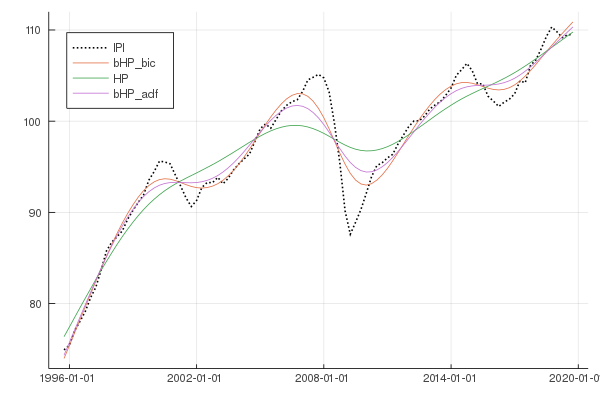

# Get Started

This package is now featured on the official general Julia package registry. 
Simply use Julia's package manager pkg to add TrendDecomposition to your preferred environment.

```Julia
@(v1.11) pkg> add TrendDecomposition

julia> using TrendDecomposition
```

The developing branch of this package can either be employed  by cloning this repository or by using the Julia package manager.
With the package manager simply use the add command:
```Julia
@(v1.11) pkg> add https://github.com/sdBrinkmann/TrendDecomposition.jl
```
!!! warning 
	This package is currently under rapid development and follows Semantic Versioning. Until the 1.0.0 release is reached,
	the API of this package can change with any minor version update, 
	please  consult the documentation of this package after each update when using this package.

## Usage

The basic usage is demonstrated with the [US industrial production index (IPI)](https://fred.stlouisfed.org/series/IPB50001SQ) provided by FRED data service.

```Julia
using TrendDecomposition
using CSV

# Set path to directory where time series is located
path = "/.../data"

IPI = CSV.read("$(path)/IPB50001SQ.csv", copycols=true)

# HP filter with λ = 1600
hp = HP(IPI[!, 2], 1600)

# The above is equivalent to Whittaker-Henderson smoothing with m = 2 differentiation
wh = bohl_filter(IPI[!, 2], 2, 1600)

# Boosted HP filter with baysian-type information criterion (BIC)
bHP_bic = bHP(IPI[!, 2], 1600, Criterion="BIC")

# Boosted HP filter with augmented Dickey-Fuller (ADF) test 
bHP_adf = bHP(IPI[!, 2], 1600, Criterion="ADF", p=0.01)
```


